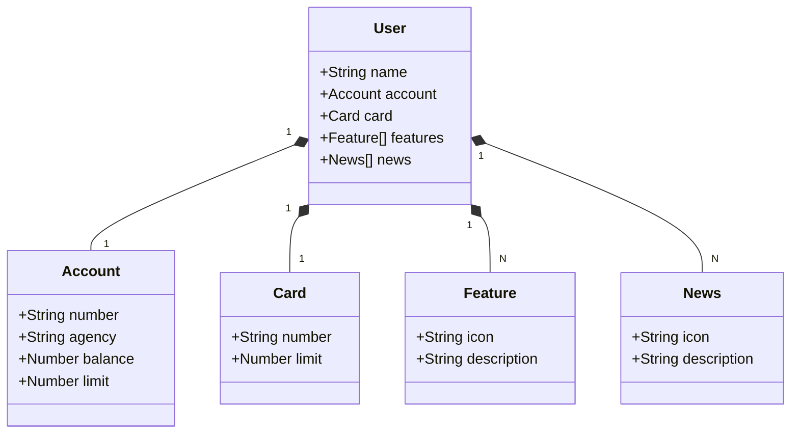

# Java Dev Week 2023

Java RESTful API criada para a Santander Dev Week

## Diagrama de Classe

```mermaid
classDiagram
    class User {
        +String name
        +Account account
        +Card card
        +Feature[] features
        +News[] news
    }

    class Account {
        +String number
        +String agency
        +Number balance
        +Number limit
    }

    class Card {
        +String number
        +Number limit
    }

    class Feature {
        +String icon
        +String description
    }

    class News {
        +String icon
        +String description
    }

    User "1" *-- "1" Account
    User "1" *-- "1" Card
    User "1" *-- "N" Feature
    User "1" *-- "N" News
```
